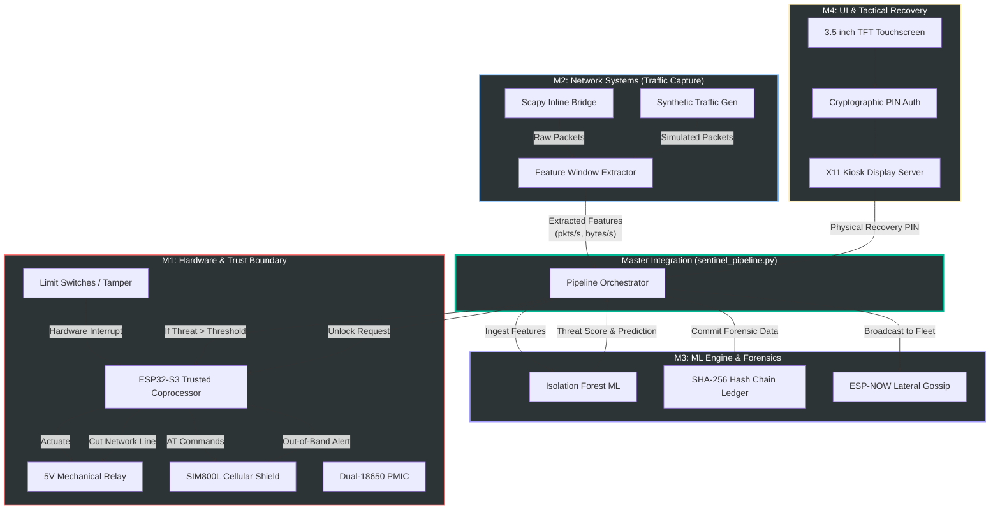

# Blackbox Sentinel: Comprehensive Project Architecture & Deep Dive

## Introduction
**Blackbox Sentinel** is an Autonomous Edge Defense Node (AEDN). It is a cyber-physical intrusion prevention system (IPS) designed to act as an ultimate physical fail-safe for critical networks. Instead of relying purely on software firewalls (which can be bypassed if the OS is compromised), Sentinel employs a **hardware-enforced mechanical air-gap**. 

The system operates across four primary modules that are orchestrated by a central integration script (`sentinel_pipeline.py`). When an anomaly is detected, the system severs the physical Ethernet data line, logs the forensic evidence into an immutable SHA-256 ledger, broadcasts the threat laterally to other nodes via an ESP-NOW mesh, sends an out-of-band cellular SMS, and locks down completely until a human administrator physically enters a recovery PIN on the device's touchscreen.

---

## 1. Master System Architecture Diagram

---

## 2. Module Deep-Dive

### Module 1: Hardware & Trust Boundary (M1)
The M1 subsystem is the physical enforcer of the network. It completely shifts the paradigm of network security by taking the actual "kill switch" away from the Linux operating system.

*   **The Trust Gap:** The Raspberry Pi 4 is considered the "Untrusted Host" because it runs a full Linux OS and connects to the internet; it is theoretically vulnerable to zero-day exploits. The **ESP32-S3** acts as the "Trusted Coprocessor." It is electrically isolated and runs bare-metal C++ firmware. 
*   **Mechanical Relay:** A 5V Songle mechanical relay is spliced directly into the TX/RX copper wires of an Ethernet cable. When the ESP32 throws the relay, the physical circuit is broken. Data physically cannot traverse an open circuit, providing a mathematically guaranteed air-gap.
*   **Cellular Out-of-Band (SIM800L):** Because an air-gapped node cannot send emails or Slack messages, the system uses a 2G/GSM cellular shield. Upon isolation, it fires an AT command to send an SMS text message to the administrator, alerting them of the breach and providing the exact SHA-256 ledger hash of the event.
*   **Tamper & Key Zeroization:** The 3D-printed enclosure is lined with micro limit switches. If an attacker tries to open the box to manually bridge the relay, the ESP32 detects the voltage drop. It instantly fires the relay (fail-secure mode) and wipes all volatile cryptographic keys from RAM (`_handle_tamper()` in the pipeline), rendering the device mathematically useless to the attacker.

### Module 2: Network Capture & Feature Extraction (M2)
M2 is responsible for ingesting raw network data without impeding throughput.

*   **Inline Bridge (`br0`):** The Raspberry Pi acts as a transparent network bridge using `brctl` and `iptables`. Traffic flows into eth0 and out of eth1. 
*   **Scapy Live Sniffing:** The system uses Python's `scapy` library to asynchronously capture packets traversing the bridge. 
*   **Feature Windowing:** Feeding raw pcaps into a machine learning model is too slow for real-time edge computing. Instead, M2 uses a rolling 1.0-second time window (`capture_live_window`). It aggregates raw packets into lightweight features:
    *   `packets_per_sec`
    *   `bytes_per_sec`
    *   `tcp_ratio` (vs UDP/ICMP)
*   **Synthetic Fallback:** If the system is deployed without a physical network interface, M2 seamlessly falls back to a synthetic `TrafficGenerator` that mimics enterprise traffic and generates randomized attacks (like EXFILTRATION or DDoS) to test the ML engine.

### Module 3: Machine Learning & Forensics (M3)
M3 provides the brains of the operation, determining *when* to pull the trigger, and proving *why* it pulled the trigger.

*   **Isolation Forest Anomaly Scoring:** M3 utilizes an unsupervised machine learning model (Isolation Forest). Unlike signature-based antiviruses that only catch known threats, Isolation Forests learn what "normal" traffic looks like during the Calibration Phase. Any traffic window that falls outside of this high-dimensional normal cluster is flagged as an anomaly.
*   **Forensic Hash-Chain Ledger:** Every time the ML model flags a threat, the exact feature window and threat score are serialized into a JSON block. This block is cryptographically hashed (SHA-256) and chained to the hash of the previous block (exactly like a blockchain). If a hacker gains access and tries to delete their tracks from the log file, the `verify_chain()` function will instantly flag the ledger as mathematically broken.
*   **ESP-NOW Lateral Gossip:** Before isolating itself, the node blasts a final localized radio broadcast over 2.4GHz using the ESP-NOW protocol. It shares the attacker's IP and threat profile with all other Blackbox Sentinel nodes in the building, allowing the rest of the fleet to preemptively raise their shields.

### Module 4: UI & Tactical Recovery (M4)
Because the device lacks a remote management interface (by design, to eliminate attack vectors), recovery must be done physically.

*   **X11 Kiosk Mode Dashboard:** The Raspberry Pi outputs to a 3.5" TFT touchscreen LCD. The UI is built using PyQt5 (or similar frameworks) and runs in a full-screen, locked-down X11 kiosk mode. The driver stack overrides standard HDMI output to push raw framebuffer data (`/dev/fb1`) directly to the SPI display.
*   **Physical PIN Authorization:** Once the relay fires, the screen turns deep red, displaying "LOCKDOWN ACTIVE." The system completely ignores any incoming SSH connections or API calls. The **only** way to restore the data line is for a human to stand in front of the box and type the cryptographic PIN into the touchscreen interface. This proves physical presence and enforces the "Zero-Remote Recovery" architecture.

---

## 3. The Master Pipeline Orchestration (`sentinel_pipeline.py`)

The pipeline script is the central nervous system. When the device powers on via the Dual-18650 UPS shield, `main.py` launches the `SentinelPipeline` class.

**Phase 1: Boot & Calibration**
The system boots, initializes the Hardware Abstraction Layer (`hal.py`), and turns the physical LED off. It enters `start_calibration()`. For a set number of windows (e.g., 50), it passively watches the network, allowing the M3 ML model to build a statistical baseline of normal behavior.

**Phase 2: ARMED Mode**
Once calibration completes, the physical LED turns solid on, and the ledger commits an `armed` block. The system enters the `_capture_loop()`. It processes network traffic in real-time.

**Phase 3: Threat Detection & Lockdown**
When a threat (like ransomware exfiltration) spikes the network bandwidth:
1. `ingest_feature_window()` returns `is_anomaly: True`.
2. The pipeline fires `self.hal.relay.isolate()`. The network is instantly killed.
3. The pipeline commits the forensic data to the SHA-256 ledger.
4. The pipeline triggers the M1 cellular module to text the Admin.
5. The pipeline triggers the ESP32 to broadcast the threat via ESP-NOW.

**Phase 4: Physical Recovery**
The network is dead. Hours later, the Admin arrives, inspects the network, clears the threat, and types the PIN into the M4 touchscreen. The pipeline calls `pin_override()`. If the PIN is valid, it calls `self.hal.relay.engage()`, reconnecting the copper Ethernet wires, and the system seamlessly drops back into ARMED mode.
