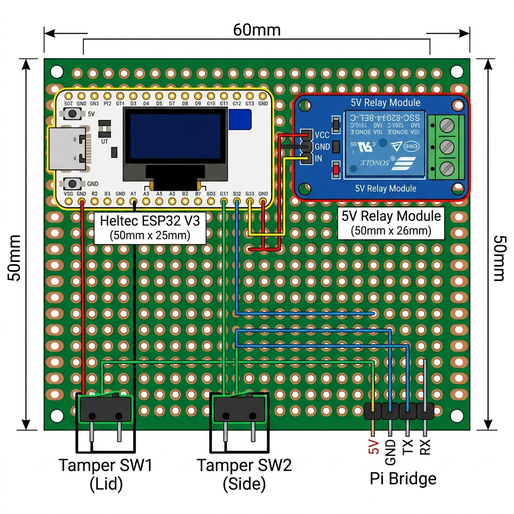

# Perfboard Assembly Guide (6×5cm Board)

## Layout Image

---

## ✅ GOES ON THE PERFBOARD (4 items only)

| # | Component | Where on Board | Orientation |
|---|-----------|---------------|-------------|
| 1 | **Heltec ESP32 V3** | Left half | USB-C port faces the LEFT edge (so you can plug in cable) |
| 2 | **5V Relay Module** | Right half | Screw terminals face the RIGHT edge (for Ethernet wire) |
| 3 | **Tamper Switch 1** | Bottom-left corner | Long wires will run to enclosure lid |
| 4 | **Tamper Switch 2** | Bottom-center | Long wires will run to enclosure side panel |
| 5 | **4-pin Male Header** | Bottom-right corner | Pins face UP (jumper wires plug in here to reach Pi) |

> [!IMPORTANT]
> The 4-pin male header is just a connector — you solder it to the perfboard so you have a clean plug point for the 4 jumper wires that go to the Raspberry Pi.

---

## ❌ DOES NOT GO ON THE PERFBOARD

| Component | Why Not | Where It Goes Instead |
|-----------|---------|----------------------|
| **Raspberry Pi 4** | It's a separate computer, way too big | Sits next to the perfboard, connected by 4 jumper wires |
| **GSM/GPRS Shield** | It's a full-size HAT (85×56mm) | Stacks directly onto the Pi's 40-pin GPIO header |
| **3.5" Touchscreen** | Same size as the Pi | Mounts on top of the GSM shield (or on enclosure lid) |
| **Dual-18650 PMIC Shield** | Powers everything from underneath | Sits below the Pi, provides 5V to the whole system |
| **USB Ethernet Adapter** | Just a dongle | Plugs into one of the Pi's USB ports |

---

## Physical Placement Steps

**Step 1:** Hold the perfboard with the long side (6cm) horizontal.

**Step 2:** Push the ESP32's pins into the LEFT half of the board. Make sure the USB-C port is at the left edge.

**Step 3:** Push the Relay Module's pins into the RIGHT half. Leave at least 5mm gap between the ESP32 and the Relay so wires don't touch.

**Step 4:** Place the two tamper switches at the bottom-left and bottom-center. These are tiny, they barely take any space.

**Step 5:** Push a 4-pin male header into the bottom-right corner. This is your "Pi Bridge" connector.

**Step 6:** Take a photo and send it to me before soldering anything!
