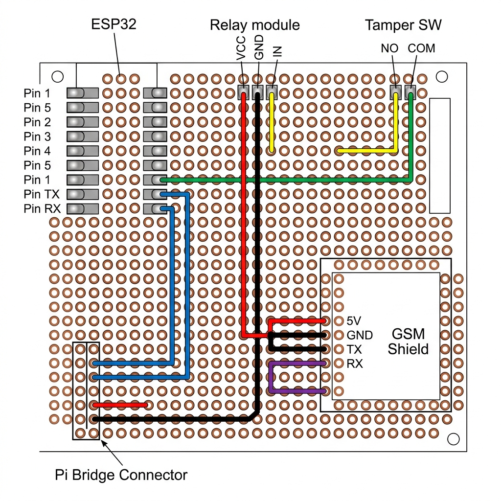

# Perfboard Soldering Guide V2 (Includes GSM Shield)

This guide shows how to wire the perfboard from the **bottom (solder side)** with the GSM shield added to the board.

Because we added the GSM shield, your "Pi Bridge" header needs to be a **6-pin header** (instead of 4) so we can run TX/RX for both the ESP32 and the GSM Shield over to the Raspberry Pi.

## Step 1: Solder the Headers/Pins (No Wires Yet)

First, we just solder the physical pins to the board so they are stable.

1.  **ESP32 Female Headers:** Insert the two 18-pin female headers into the top-left of the perfboard. Flip the board over and solder every pin.
2.  **Relay Module:** Insert the 3 pins of the relay module. Solder them.
3.  **GSM Shield:** Solder female headers into the bottom-right for the GSM Shield (or push its pins straight through and solder them).
4.  **Pi Bridge Header:** Insert a **6-pin** male header on the bottom-left edge. Solder it.
5.  **Tamper Switches:** Insert the pins for the tamper switch. Solder them.

## Step 2: The Common Ground Rail (Black Wires)

All components must share the same ground to communicate correctly. This is the most important connection.

Solder a wire connecting ALL of these pins together:
*   ESP32 **GND** pin
*   Relay Module **GND** pin
*   Tamper Switch **COM** pin
*   GSM Shield **GND** pin
*   Pi Bridge Header **GND** pin

## Step 3: The 5V Power Rail (Red Wires)

The Pi bridge will bring 5V into the perfboard from the battery shield. GSM modules draw up to 2 Amps, so use a slightly thicker wire for this if you have one.

Solder a wire connecting:
*   Pi Bridge Header **5V** pin
*   Relay Module **VCC** pin
*   GSM Shield **5V** pin

*(Note: The ESP32 is powered via the 3.3V pin from the battery shield directly via jumper wire, not from this 5V rail).*

## Step 4: The Signal Lines

Now connect the specific data lines point-to-point.

1.  **Relay Control (Yellow):** Solder a wire from ESP32 **Pin 4** to Relay **IN** pin.
2.  **Tamper SW (Green):** Solder a wire from ESP32 **Pin 5** to Tamper SW **NO** (Normally Open) pin. (If using two switches, wire the second to Pin 6).

## Step 5: The Serial Bridges (Blue & Purple)

We have two separate serial connections going to the Pi.

1.  **ESP32 Serial (Blue):**
    *   Solder ESP32 **TX** to Pi Bridge Pin 3 (**ESP_RX**)
    *   Solder ESP32 **RX** to Pi Bridge Pin 4 (**ESP_TX**)
2.  **GSM Serial (Purple):**
    *   Solder GSM Shield **TXD** to Pi Bridge Pin 5 (**GSM_RX**)
    *   Solder GSM Shield **RXD** to Pi Bridge Pin 6 (**GSM_TX**)

## Review

Before applying power, use a multimeter in continuity mode to check:
1.  **GND to 5V:** Make sure they do NOT beep (no short circuit).
2.  **All GND pins:** Make sure they ALL beep when touching each other.
